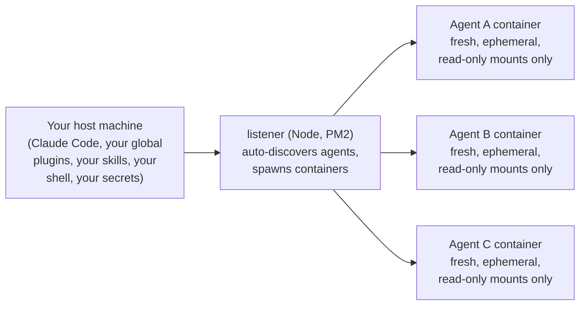
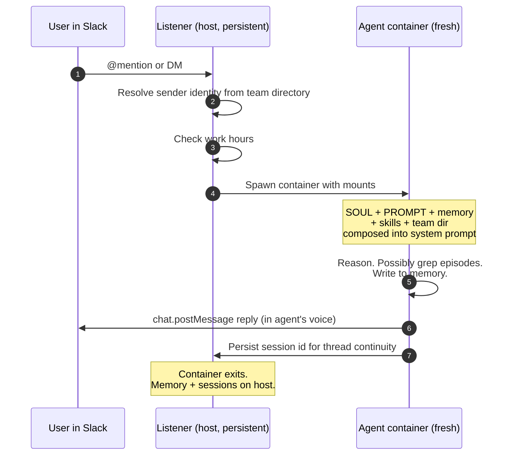

<h1 align="center">ginnie-agents</h1>

<p align="center">
  <em>AI teammates that live in your Slack and act like teammates.</em><br/>
  <em>Set up entirely from inside Claude Code. No UI, no hosting.</em>
</p>

<p align="center">
  <a href="https://ginnie-agents.vercel.app"><strong>Website</strong></a> &middot;
  <a href="#quickstart"><strong>Quickstart</strong></a> &middot;
  <a href="#what-it-can-do-for-you"><strong>What you build</strong></a> &middot;
  <a href="#what-you-actually-get"><strong>Features</strong></a> &middot;
  <a href="ARCHITECTURE.md"><strong>Architecture</strong></a> &middot;
  <a href="https://github.com/nitaybz/ginnie-agents/releases"><strong>Releases</strong></a>
</p>

<p align="center">
  <a href="LICENSE"></a>
  <a href="https://github.com/nitaybz/ginnie-agents/releases"></a>
  
  
</p>

---

## Why I built this

I run a small smart-home company called Ginnie (hence ginnie-agents). There's always more work to do than hands to do it. Investigations, reports, dashboards to scan, patterns to catch, follow-ups to chase. The work is real, and most of it is mechanical: checking, summarizing, drafting, monitoring, deciding when to escalate.

I wanted *more hands*. Not chatbots, not function-calling demos. Teammates: with names, with their own Slack channels, with persistent memory, with judgment, with daily rhythms. Things I can talk to in Slack like I talk to anyone else, that take ownership of an area, learn from feedback, and stop being noise.

I built ginnie-agents to make that happen, and I run my own team on it every day. This is the framework, stripped to be useful for anyone running their own.

## Set up entirely from inside Claude Code

The single most opinionated decision in this repo: **Claude Code is the installer, the configurator, and the operator.**

You don't run a CLI. You don't fill out a config wizard. You don't edit YAML in three places. You clone the repo, you open it in Claude Code, and you say things like:

```
set me up
create an agent for handling support tickets
add my co-founder to the team directory
the listener seems off, run doctor
update the framework
```

Every operational concern, from first install to creating an agent to pulling framework updates, is handled by a Claude Code skill that ships in this repo. The instructions, the templates, the manifest examples, the diff scripts, the helper that atomically rotates Slack config tokens, all of it is written for Claude Code to follow. You describe intent; the skills do the work.

That's why the framework feels light to set up even though it's wiring up Slack apps, Docker, PM2, git hooks, schedules, and a small daemon. The complexity is real; Claude Code absorbs it.

**The Slack part can be either fully manual or roughly 80% automated, your call.** During first-run setup, Claude asks whether you want to set up Slack apps programmatically or by hand. If you give it a one-time Slack workspace admin token, every future `create-agent` flow uses Slack's manifest API to create the app's scopes, events, and Socket Mode in a single API call. You still do three clicks per agent (install in workspace, copy bot token, generate App-Level Token) because Slack doesn't expose an API for those, but you skip the ~17 clicks of adding scopes one by one. If you'd rather keep it manual, Claude walks you through every click, top to bottom. Either way, Claude is the one telling you what to click.

## What it can do for you

You write what an agent should do; the framework handles everything else. Some real-world shapes that fit:

- **An ops monitor** that watches your infrastructure, opens tickets when something breaks, follows up until it's fixed, knows what to escalate.
- **A marketing agent** that tracks campaigns, applies safe optimizations on its own, drafts the risky ones for your approval, posts a daily summary.
- **A sales analyst** that pulls call recordings and CRM data each morning, finds patterns, posts a digest, asks sharp follow-ups.
- **A personal assistant** you can DM with anything, that remembers what you've told it across weeks and surfaces what you've been worrying about.
- **A code-review companion** that watches your PRs and flags patterns its memory says you've discussed before.
- **A standup assistant** that DMs each teammate, collects updates, posts a synthesis.

Pick a job, sketch the agent, ship it. Roughly 15 minutes from idea to a working teammate in your workspace, including writing the agent's voice and creating its Slack app.

## ginnie-agents is right for you if

- ✅ You use Claude Code, with either a Claude subscription (Pro/Max/Team/Enterprise) or an Anthropic API key. See [Authentication and cost](#authentication-and-cost) for which to pick.
- ✅ Your team is on Slack and you'd rather your AI agents live there.
- ✅ You want agents that **persist memory** across sessions and weeks, not goldfish.
- ✅ You want each agent **isolated**, with its own Slack identity, its own permissions, and its own routines.
- ✅ You want to be able to **manage everything from inside Claude Code** rather than juggling YAML and a separate UI.
- ✅ You're comfortable self-hosting (a Linux box, a Mac mini, your home server, anywhere with Docker).

If any of those don't fit, this is honest about what it isn't (see [What this is NOT](#what-this-is-not)).

## What you actually get

The headline isn't a single feature, it's that all of these are wired together and working out of the box:

### Memory the agent grows into

Three tiers. The first two are always loaded into the system prompt; the third is a journal the agent greps on demand.

```
agents/<name>/memory/
├── rules.md         <= 200 lines  always loaded   user-stated requirements
├── playbook.md      <= 300 lines  always loaded   settled patterns
└── episodes/
    ├── 2026-Q1.md   no cap        grepped         raw journal, append-only
    ├── 2026-Q2.md
    └── 2026-Q3.md
```

- **`rules.md`** is for things you say directly. *"Always reply in the same language the user wrote in."* *"Never auto-apply changes that increase budget by more than 20%."* The agent edits this file the first time you state a rule. One line, no narrative. Hard cap of 200 lines because it's in every system prompt forever.
- **`playbook.md`** is for patterns the agent has learned and a nightly consolidation routine has settled. *"When CTR drops 20%+ for 3+ days, check device-mix shift before increasing budget."* Always loaded, capped at 300 lines, only the consolidation routine writes here.
- **`episodes/`** is the journal. Append-only, quarterly-rotated, NOT loaded into the system prompt. Every meaningful exchange goes here. The agent uses `grep` to pull exactly the past it needs when you ask "what did we conclude about X last month?"

There's no "load my recent memory" tool, by design. Such a tool always loads either too much (bloated context) or too little (missed history). Letting the agent grep means it pulls exactly what's relevant to the question.

Three protections keep memory from rotting: `merge=union` on memory files in `.gitattributes` (any merge keeps both sides' lines); a `commit-msg` git hook that rejects commits exceeding the caps or shrinking an episode file; and the Watcher daemon that DMs you when a memory file approaches its cap, so you fix it before the hook bites.

### Routines

Each agent has a `schedules.json` it owns. Cron-style entries the listener watches and reloads automatically:

```json
{
  "schedules": [
    { "id": "morning-brief",     "cron": "0 8 * * *",         "message": "Morning brief: top 3 issues, anything new overnight." },
    { "id": "fleet-scan",        "cron": "*/30 8-21 * * 1-5", "message": "Scan the fleet. Open tasks for new issues. Stay silent if nothing changed." },
    { "id": "memory-consolidate","cron": "30 4 * * *",         "message": "Run the consolidation routine.", "enabled": true }
  ]
}
```

Agents can edit this file themselves at runtime. *"Add a weekly review at Mondays 10am"* and the agent does it. The listener reloads on file change, no restart needed.

### Tagging (agents know who's talking to them)

Every message reaching an agent is prefixed by the framework with sender identity:

```
From: <name> | role: <role> | email: <if known>
@mention text from the user
```

Agents respond differently to a founder, a peer agent, a teammate, or an unknown user. Sender identity comes from the merged team directory; if a sender isn't in the directory, the framework marks them `unknown` or `external`. For agents with `boundaries: "write"`, the listener refuses to dispatch from `unknown`/`external` senders at all — the agent never wakes up. Defense-in-depth on top of any prompt-level guidance. Read-only agents are not gated (their blast radius is bounded). Per-agent opt-out: `"allow_unverified_senders": true` in `config.json`, for cases like a public Q&A bot where you do want random Slack users answered.

### Work hours

Each agent has `work_hours` in its `config.json`:

```json
{
  "work_hours": {
    "enabled": true,
    "start": "09:00",
    "end":   "18:00",
    "days":  ["mon", "tue", "wed", "thu", "fri"],
    "off_hours_behavior": "deferred_response"
  }
}
```

When enabled and a message arrives outside the window, the framework either drops it silently (`ignore`) or posts a one-line off-hours notice and skips dispatch (`deferred_response`). Scheduled routines fire regardless; work hours only gate inbound human messages.

### Skills (personal, shared, framework-internal)

Skills are reusable knowledge or procedure. Three layers, all loaded automatically:

```
framework/skills/      shipped with the framework, every agent gets them (memory-curation, etc.)
shared/skills/         your cross-agent skills (a CRM client, a SQL templates pack, anything)
agents/<name>/skills/  personal to one agent
```

Write a skill once in `shared/skills/`, every agent on your team picks it up. No duplication, no drift, edit one place. Two different agents that both touch the same CRM share the same client skill instead of each having their own.

### Known users with selective visibility

Your team directory lives in two places, merged at runtime:

- **`shared/known-users.json`** for people most agents should know.
- **`agents/<name>/known-users.json`** for people only this agent knows (a customer-success agent's customers, a vendor list visible only to ops).

Same key in both, the local entry wins for that key only. Otherwise union. This means selective visibility: a customer-success agent can know specific customers without those entries leaking into the operations agent's team directory. When you create a new agent, the `manage-known-users` skill asks one question: *"Visible to all agents, specific agents, or none?"* and only follows up if you said specific.

### Boundaries (read-only vs. write, enforced at SDK level)

Each agent's `config.json` declares it as `"boundaries": "read-only"` or `"write"`. The runner enforces this by overriding `allowed_tools` at spawn time:

- **`read-only`** restricts the toolkit to `Read`, `Grep`, `Glob`, `WebSearch`, `WebFetch`. No `Bash`, no `Write`, no `Edit`. Enforced at the SDK layer regardless of what the prompt says. **Note:** this prevents the agent from *mutating* state (writing files, running shell commands), but it does not prevent *outbound data exfiltration* (a read-only agent can still `Read` secrets and `WebFetch` them out). Use `read-only` to contain blast radius from misbehavior, not as a guarantee against a compromised agent leaking data; the threat-model section in [ARCHITECTURE.md](ARCHITECTURE.md) is explicit about what each layer does and does not protect against.
- **`write`** is the default; agent gets the full toolkit it declared.

Useful for analyst agents that should never accidentally mutate state, or for any agent you're not yet ready to give shell access to.

### Personality and avatar (a small but useful addon)

Each agent has a `SOUL.md`: a short backstory, voice rules, and a couple of quirks. The runner injects it into the system prompt between the team directory and the operational layer, so the agent forms identity before learning its job. Optional, but the difference between a "polished robot" and "actually feels like a person to talk to" is small (25 to 35 lines) and worth it.

Each agent also gets its own Slack avatar, picked by you. The `create-agent` skill derives an image-generation prompt from `SOUL.md` (so the picture matches the personality), tells you to run it through whatever image AI you prefer, and ships an ImageMagick one-liner that crops the result to Slack's 1024 x 1024 square. Optional, but agents with real avatars feel a lot more like teammates than agents with the default Slack bot icon.

## Each agent runs sterilized

This is the part that makes self-hosting safe to actually use:



Every agent session runs in its own fresh Docker container via the Claude Agent SDK. The container has:

- The agent's own `PROMPT.md`, `SOUL.md`, memory, skills, schedules (mounted read-only or read-write per file).
- The shared user directories: `shared/skills/` and `shared/known-users.json` (read-only).
- The framework-internal skills: `framework/skills/memory-curation/SKILL.md` (read-only).
- The agent's own credentials (read-only).
- A long-lived OAuth token via env var.

That's it. The container does NOT have:

- Your host's Claude Code plugins, skills, or settings.
- Your host's shell history, dotfiles, or environment variables.
- Other agents' memory, credentials, or skills.
- Anything outside `/workspace/` and `/home/node/.claude/` inside the container.

Containers are short-lived (one per session), stateless beyond what they write to mounted memory files, and isolated from each other. This means you can run a marketing agent that touches your ad accounts and an ops agent that touches your infrastructure on the same host with confidence: neither can see the other's credentials, mess with the other's memory, or accidentally invoke the other's skills.

It also means agents stay clean. Your host's globally-installed Claude Code plugins, skills, MCP servers, and personal preferences don't bleed into how an agent behaves. What you wrote in `PROMPT.md` and `SOUL.md` is what the agent is, every time.

## Authentication and cost

The framework supports two ways to authenticate the Claude Agent SDK calls each container makes. Pick the one that matches how you run the platform.

### Option A — OAuth token from a Claude subscription (default)

Generated by `claude setup-token` during first-run setup. Long-lived (~1 year), cheap (flat subscription cost), zero per-call billing. This is what the **setup** skill configures by default.

**Read this before you choose it.** Per Anthropic's [usage policy][anthropic-aup], OAuth authentication is intended for *ordinary, individual use of Claude Code* by the subscriber. Anthropic explicitly does not permit *"routing requests through Free, Pro, or Max plan credentials on behalf of [other] users."*

In practice, OAuth is appropriate when:
- You are the subscriber, **and**
- The agents are your personal/internal automation, **and**
- Volume stays in a sane range for one human's usage.

It is **not** appropriate (and risks token revocation or account suspension) when:
- Agents serve external customers or users outside your team.
- ginnie-agents is operated as a hosted product on behalf of others.
- Volume materially exceeds what one developer would consume.

Anthropic reserves the right to enforce these restrictions without prior notice. If your use case looks anything like the second list, use Option B.

### Option B — Anthropic API key (Console)

Generated at [console.anthropic.com](https://console.anthropic.com). Billed per-token. Fully supported by Anthropic's terms for automation, products, and multi-user scenarios. Higher cost than a flat subscription, but no authentication risk.

### How to switch

Set **either** `CLAUDE_CODE_OAUTH_TOKEN` **or** `ANTHROPIC_API_KEY` in `.env`. If both are set, `ANTHROPIC_API_KEY` wins. The `setup` skill asks which path you want during first-run setup.

[anthropic-aup]: https://code.claude.com/docs/en/legal-and-compliance#authentication-and-credential-use

## How it talks to Slack

Everything runs through Slack's Socket Mode (WebSocket transport). No public URLs, no webhooks, no reverse proxies, no static IPs. Works behind NAT, on a laptop, on a home server, anywhere with outbound TCP.

Each agent has its own Slack app, with its own avatar, its own bot identity, its own channel. The listener spawns one Bolt app per agent, so message routing is handled natively by Slack: an `@mention` or DM on agent A's app reaches only agent A's handlers.



## The full set of skills you get

The repo ships with nine Claude Code skills that cover the entire lifecycle. You never run a CLI; you ask Claude.

| Skill | What it does | Trigger phrase examples |
|---|---|---|
| **setup** | First-run setup. Verifies prerequisites, runs `claude setup-token` for the long-lived token, scaffolds `.env`, installs git hooks, builds the Docker image, builds the listener, starts PM2. | *"set me up"*, *"first run"*, *"install"* |
| **create-agent** | Walks you through creating a new agent end to end. Discovery, SOUL, mission, schedule, boundaries, work hours, avatar prep, Slack app creation (programmatic via manifest API or fully manual), team directory registration, smoke test. | *"create an agent for handling support tickets"*, *"new agent"* |
| **update-framework** | `git pull` from upstream, conditional Docker rebuild, conditional listener rebuild, `pm2 restart`, doctor verification. Also runnable as a script for the Watcher's `[Update now]` button. | *"update the framework"*, *"upgrade"* |
| **doctor** | Health check across prerequisites, env, hooks, listener, Docker image, agents, memory caps, disk. Delegates to `scripts/doctor.sh` for deterministic mechanical checks; the skill adds Slack-reachability and token-age context. | *"doctor"*, *"is everything ok"* |
| **manage-known-users** | Add, edit, or remove humans and agents from the team directory. Asks the visibility tree question (all agents, specific agents, or none) so you don't accidentally make every entry visible to every agent. | *"add a known user"*, *"register my new teammate"* |
| **manage-routines** | View, add, edit, or disable schedules in an agent's `schedules.json`. Live-reloaded by the listener; no restart needed. | *"add a routine for the ops agent"*, *"change the schedule"* |
| **manage-work-hours** | Configure when an agent responds to inbound user messages. Off-hours behavior options. | *"make the sales agent only respond during business hours"* |
| **logs** | Tail, search, or download listener and per-agent logs. Wraps `pm2 logs` and per-agent log files with friendly diagnostics for common symptoms. | *"show logs"*, *"why didn't the agent respond at 3pm?"* |
| **setup-watcher** | Wire up the optional Watcher daemon. Creates the Watcher's Slack app via manifest, walks the install, captures tokens, configures `.env`, registers the PM2 process. | *"set up the watcher"*, *"watchdog"* |

Plus an atomic helper at `scripts/rotate-slack-config-token.sh` that rotates Slack config tokens and writes the new pair back atomically, so that "I rotated and lost the new pair" failure mode can't happen.

## The Watcher

The framework ships one bot, called Watcher. Not an AI agent (no Claude tokens). It runs alongside the listener, watches your install, and DMs you on Slack only when something needs attention. Interactive buttons on actionable alerts:

- **Framework update available**: `[Update now]` `[Remind tomorrow]` `[Skip this version]`. Click `[Update now]` and Watcher edits the message in place. `Updating...` then the tail of the actual `git pull` and rebuild output, then `Updated`.
- **Listener errored**: `[View logs]` `[Restart listener]`. Last 30 lines posted in the same DM, restart actionable from Slack.
- **Memory cap nearly hit**: `[Ack 24h]` `[Ack 7d]`.

Plus a `/watcher` slash command in any channel: `status`, `check`, `pause [hours]`, `resume`, `doctor`.

Watching `df` and `git fetch` doesn't need AI; Watcher is plain Node + Bolt + shell-out, deterministic, free, fast. Agents get their own model (judgment work, AI, container per session). The framework treats them as different shapes on purpose.

## Quickstart

You need:

- Node.js 22+
- Docker (running)
- Auth: a Claude subscription (Pro/Max/Team/Enterprise) **or** an Anthropic API key — see [Authentication and cost](#authentication-and-cost)
- A Slack workspace where you can create apps

```bash
git clone https://github.com/nitaybz/ginnie-agents
cd ginnie-agents
```

Open the directory in Claude Code and ask:

> **"set me up"**

The `setup` skill handles the rest. End state: a running listener with no agents.

Then:

> **"create an agent for &lt;role&gt;"**

That's it.

## What this is NOT

Setting expectations honestly:

- **Not multi-LLM.** Claude Code + Max only. No OpenAI, no Gemini, no API SDK.
- **Not non-Slack.** No Discord, no Teams, no email integrations.
- **Not hosted.** Self-hosted only. You run the listener yourself.
- **Not no-Docker.** Agents always run in isolated containers.
- **Not multi-machine.** Single host.
- **Not Windows.** macOS and Linux only.
- **Not a UI.** Slack and Claude Code are the interfaces.

If any of those are dealbreakers, this isn't your framework.

## Status

- **Released**: v0.1.0 (initial), v0.2.0 (the Watcher), v0.2.1 (polish from the first real install). See [Releases](https://github.com/nitaybz/ginnie-agents/releases) and [CHANGELOG](CHANGELOG.md).
- **Validated** end-to-end: fresh-clone install on a clean machine, full create-agent flow, live Slack DM round-trip with the agent's voice and memory both working.
- **MIT-licensed.**

If you try it and something breaks, file an issue. PRs welcome, especially on the skills.

## License

[MIT](LICENSE).
